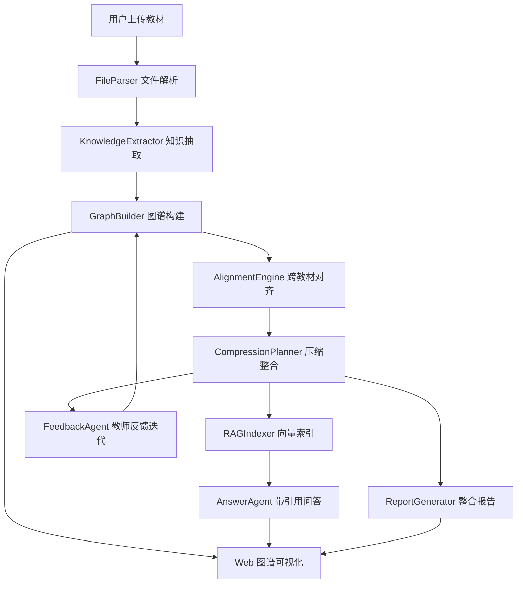

# 学科知识整合智能体项目规划文档

## 1. 项目目标

本项目面向“AI 全栈极速黑客松·学科知识整合智能体开发”赛题，目标是在 Web 应用中完成多本教材的自动解析、知识图谱构建、跨教材去重整合、RAG 精准问答和教师多轮反馈迭代，最终将多本教材压缩为不超过原始体量 30% 的精华知识库，并输出可解释的整合报告。

核心交付目标：

- 支持 PDF、Markdown、TXT 教材上传、解析和章节识别。
- 为单本教材抽取知识点和关系，生成可交互知识图谱。
- 对多本教材进行语义对齐、去重、合并、保留和删除决策。
- 基于整合后的教材内容建立 RAG 索引，回答时必须附带原文引用。
- 支持教师通过自然语言反馈修改整合决策，并同步更新图谱。
- 提交完整文档，包括需求分析、系统设计、Agent 架构说明、README 和整合报告。

## 2. 产品范围与优先级

### 2.1 P0 必做闭环

P0 目标不是做全做炫，而是保证评委可以稳定完成一条完整路径：

上传教材 -> 解析章节 -> 抽取知识点 -> 展示图谱 -> 跨教材整合 -> 建立 RAG 索引 -> 带引用问答 -> 教师反馈修改 -> 生成报告。

功能拆解：

- 教材管理：批量上传、文件列表、解析状态、章节预览。
- 文件解析：PDF、MD、TXT 必须支持；DOCX 可作为增强项。
- 知识抽取：按章节调用 LLM，输出节点和边的结构化 JSON。
- 图谱展示：节点点击详情、缩放、拖拽、来源颜色、频次大小或深浅。
- 跨教材整合：Embedding 语义相似度作为主判断，LLM 复核高风险样本。
- 压缩控制：统计原始字数、整合后字数和压缩比，保证不超过 30%。
- RAG 问答：chunking、embedding、向量检索、LLM 生成、引用来源。
- 多轮对话：针对整合决策解释原因，并允许教师保留、拆分或合并知识点。
- 文档与报告：完成赛题要求的核心文档和 `report/整合报告.md`。

### 2.2 P1 加分优先级

优先选择“低成本、高评分可见度”的加分项：

- 图谱搜索与高亮。
- 混合检索：向量检索 + BM25，再做简单重排序。
- RAG Benchmark：生成 20 个测试问题，统计引用命中率和响应时间。
- Token 消耗统计：记录每次 LLM 调用的输入、输出和估算成本。
- Docker 一键部署。
- 报告导出 PDF。

### 2.3 P2 挑战项建议

如果 P0 和主要 P1 已完成，建议选择“RAG 检索策略优化”作为 P2 技术报告主题。该方向最容易在短时间内做量化实验，可比较不同 chunk 大小、是否混合检索、是否 rerank 对引用命中率和响应时间的影响。

## 3. 推荐技术方案

### 3.1 总体技术栈

- 前端：React + Vite + TypeScript。
- 可视化：Cytoscape.js，优先保证图谱交互稳定。
- 后端：FastAPI。
- 文件解析：PyMuPDF 解析 PDF，Markdown/TXT 直接读取，python-docx 支持 DOCX。
- 数据存储：SQLite 存结构化数据，文件系统保存上传文件和中间 JSON。
- 向量库：FAISS 或 ChromaDB，优先选择 FAISS 以降低部署复杂度。
- Embedding：BGE-small-zh 或 paraphrase-multilingual-MiniLM-L12-v2；如部署环境不便，保留 OpenAI Embedding API 配置。
- LLM：通过统一 Provider 层适配 OpenAI、DeepSeek、通义千问等模型。
- 部署：Docker Compose 或魔搭创空间。

### 3.2 模块划分

建议采用“模块化单 Agent 编排 + 专项工具模块”的方案。这样比硬拆多 Agent 更适合 5 小时赛程，职责清晰、实现风险低，也便于在架构文档中论证。

模块职责：

- FileParser：负责教材上传、格式识别、章节切分、页眉页脚过滤和结构化输出。
- KnowledgeExtractor：负责章节级知识点与关系抽取。
- GraphBuilder：负责单本教材图谱构建、统计和可视化数据生成。
- AlignmentEngine：负责跨教材知识点语义对齐和整合决策。
- CompressionPlanner：负责控制压缩比，按重要性、覆盖度和重复度筛选内容。
- RAGIndexer：负责 chunking、embedding、索引构建和检索。
- AnswerAgent：负责基于检索上下文生成带引用答案。
- FeedbackAgent：负责解释整合决策、解析教师反馈并修改决策。
- ReportGenerator：负责生成整合报告和统计摘要。

架构草图：



## 4. 核心数据设计

### 4.1 教材结构

```json
{
  "textbook_id": "book_01",
  "filename": "生理学.pdf",
  "title": "生理学",
  "format": "pdf",
  "total_pages": 520,
  "total_chars": 385000,
  "chapters": [
    {
      "chapter_id": "ch_01",
      "title": "第一章 绪论",
      "page_start": 1,
      "page_end": 15,
      "content": "...",
      "char_count": 8500
    }
  ]
}
```

### 4.2 知识图谱节点

```json
{
  "id": "book01_node_001",
  "name": "动作电位",
  "definition": "细胞受到刺激后膜电位发生的一次快速而可逆的倒转。",
  "category": "核心概念",
  "textbook_id": "book_01",
  "chapter": "第二章 细胞的基本功能",
  "page": 35,
  "source_excerpt": "..."
}
```

### 4.3 知识图谱关系

```json
{
  "source": "book01_node_001",
  "target": "book01_node_002",
  "relation_type": "prerequisite",
  "description": "理解动作电位需要先掌握静息电位。"
}
```

### 4.4 整合决策

```json
{
  "decision_id": "merge_001",
  "action": "merge",
  "affected_nodes": ["book01_node_015", "book03_node_032"],
  "result_node": "merged_node_001",
  "reason": "两个节点都描述同一核心概念，保留定义更完整且来源更清晰的版本。",
  "confidence": 0.92,
  "status": "active"
}
```

### 4.5 RAG 引用

```json
{
  "answer": "...",
  "citations": [
    {
      "textbook": "病理学",
      "chapter": "第四章 炎症",
      "page": 78,
      "relevance_score": 0.92,
      "chunk_id": "chunk_001"
    }
  ]
}
```

## 5. API 规划

### 5.1 教材与解析

- `POST /api/textbooks/upload`：上传一个或多个教材文件。
- `GET /api/textbooks`：获取教材列表和解析状态。
- `GET /api/textbooks/{textbook_id}`：获取教材结构和章节。
- `POST /api/textbooks/{textbook_id}/parse`：触发解析任务。

### 5.2 知识图谱

- `POST /api/graph/build`：为指定教材构建知识图谱。
- `GET /api/graph/{textbook_id}`：获取单本教材图谱。
- `GET /api/graph/merged`：获取整合后图谱。
- `POST /api/graph/search`：搜索并高亮知识点。

### 5.3 跨教材整合

- `POST /api/integration/run`：执行跨教材整合。
- `GET /api/integration/decisions`：获取整合决策列表。
- `POST /api/integration/decisions/{decision_id}/update`：人工或对话修改决策。
- `GET /api/integration/stats`：获取压缩比和节点统计。

### 5.4 RAG 问答

- `POST /api/rag/index`：建立或更新向量索引。
- `GET /api/rag/status`：查询索引状态。
- `POST /api/rag/query`：提交问题并返回带引用回答。

### 5.5 教师反馈与报告

- `POST /api/chat`：教师多轮反馈对话。
- `GET /api/chat/history`：获取当前会话历史。
- `POST /api/report/generate`：生成整合报告。
- `GET /api/report`：获取报告内容。

## 6. 前端页面规划

采用单页应用，建议使用三栏布局：

- 左侧教材管理区：上传入口、文件列表、解析状态、章节树。
- 中间图谱主画布：单本图谱、整合图谱、节点详情、搜索框、视图切换。
- 右侧功能面板：整合决策、RAG 问答、教师对话、统计报告。

关键交互：

- 点击节点展示定义、章节、页码和原文片段。
- 节点颜色表示教材来源，节点大小表示跨教材出现频次。
- 整合决策列表支持查看理由、撤销、强制保留、强制合并和拆分。
- RAG 引用支持展开原文 chunk。
- 顶部状态栏展示已上传教材数、已索引 chunk 数、压缩比、当前任务状态。

## 7. 实施里程碑

### 7.1 第一阶段：最小可运行骨架

目标：跑通前后端和基础数据流。

- 初始化 FastAPI + React 项目。
- 完成文件上传接口和前端上传区域。
- 建立 SQLite schema 和本地存储目录。
- 实现 MD/TXT 解析，PDF 先完成逐页文本抽取。

验收：上传文件后，前端能看到状态变更和章节/内容摘要。

### 7.2 第二阶段：图谱构建闭环

目标：完成单本教材知识图谱。

- 设计 LLM JSON Prompt。
- 按章节抽取知识点和关系。
- 保存节点、边、原文出处。
- 前端用 Cytoscape.js 渲染图谱。

验收：选择一本教材后，能看到节点、边，点击节点能查看详细信息。

### 7.3 第三阶段：跨教材整合闭环

目标：完成去重提纯和压缩比控制。

- 为知识点名称和定义生成 embedding。
- 按相似度阈值召回候选重复节点。
- 对高相似候选执行 merge/keep/remove 决策。
- 生成整合决策列表和压缩比统计。

验收：加载 2 本以上教材后，系统能输出整合决策，且整合后字数不超过原始 30%。

### 7.4 第四阶段：RAG 问答闭环

目标：完成带引用问答。

- 将正文按 500-800 字切块，保留 50-100 字重叠。
- 保存 chunk 元数据：教材、章节、页码、文本。
- 构建向量索引并支持 top-5 检索。
- LLM 只基于检索上下文回答，并输出引用。

验收：用户提问后，回答包含正文、引用列表、相关度分数和可展开原文。

### 7.5 第五阶段：教师反馈和报告

目标：增强可解释性和最终提交材料。

- 对每项整合决策生成可解释理由。
- 支持教师用自然语言修改至少一项决策。
- 修改后更新决策状态和图谱展示。
- 自动生成 `report/整合报告.md`。
- 补齐 README、需求分析、系统设计、Agent 架构说明。

验收：教师反馈能改变整合结果，报告数据与系统统计一致。

### 7.6 第六阶段：加分优化

目标：提高评分上限。

- 图谱搜索和高亮。
- 混合检索 + 简单 rerank。
- 20 题 RAG Benchmark。
- Docker Compose。
- Token 统计。
- 多视图图谱或整合前后对比视图。

## 8. 5 小时比赛执行策略

如果严格按 5 小时推进，建议如下：

- 0:00-0:30：搭项目骨架、环境变量、上传接口和前端布局。
- 0:30-1:30：文件解析、章节识别、教材列表。
- 1:30-2:30：知识抽取、图谱数据、图谱可视化。
- 2:30-3:20：跨教材整合、压缩比、决策列表。
- 3:20-4:00：RAG 索引、问答、引用展示。
- 4:00-4:30：教师反馈修改决策、报告生成。
- 4:30-5:00：部署、README、Agent 架构说明、验收检查。

实际开发时，优先保证每个模块都有可演示结果，不要在单点算法上过度打磨。评委更容易为“完整闭环 + 清晰解释 + 稳定演示”给分。

## 9. 关键算法策略

### 9.1 章节识别

- PDF 按页解析，逐页提取文本，避免一次性加载整本书。
- 优先用正则识别“第 X 章”“Chapter X”“第 X 节”等标题。
- 无法识别章节时，按固定页数或标题候选兜底切分。
- 页眉页脚通过重复行频率过滤。

### 9.2 知识点抽取

- 每次只处理一个章节，控制上下文长度。
- Prompt 强制输出 JSON，并限制节点数量。
- 关系类型至少支持 prerequisite、parallel、contains、applies_to 中的三种。
- 抽取失败时自动重试一次，并要求模型修复 JSON。

### 9.3 跨教材对齐

- 第一层：名称标准化，处理大小写、空格、中英文括号、同义表达。
- 第二层：embedding 相似度召回候选。
- 第三层：LLM 判断候选是否等价，并给出理由。
- 决策阈值建议：相似度高于 0.86 直接候选合并，0.72-0.86 进入 LLM 复核，低于 0.72 默认保留。

### 9.4 压缩策略

- 优先保留跨教材高频知识点、前置依赖节点和连接度高的核心节点。
- 对重复节点合并定义，保留最清晰来源。
- 对孤立、低频、解释重复且无教学链路影响的节点执行 remove。
- 压缩后检查 prerequisite 链路，避免删除导致教学逻辑断裂。

### 9.5 RAG 策略

- 默认 chunk 大小 600 字，重叠 80 字，平衡语义完整性与检索精度。
- 检索 top-5 chunk 注入 LLM。
- Prompt 明确要求：只根据上下文回答，不知道就说“当前知识库中未找到相关信息”。
- 引用格式统一为 `[教材名称, 第 X 章, 第 X 页]`。

## 10. 文档交付计划

必须提交：

- `README.md`：项目简介、环境依赖、配置、启动、使用说明。
- `memory-bank/requirements-analysis.md`：知识点粒度、重复判定、教学连贯性、压缩比、RAG 分块依据。
- `memory-bank/system-design.md`：架构图、数据流、技术选型、API 一览。
- `memory-bank/agent-architecture.md`：架构总览、设计决策、调用链路、取舍权衡、创新点。
- `report/整合报告.md`：7 本教材整合概览、决策摘要、图谱统计、案例、教学完整性说明。
- `.gitignore`：必须排除教材 PDF 和大文件。

建议补充：

- `memory-bank/api-documentation.md`：请求/响应示例。
- `memory-bank/rag-benchmark.md`：测试集、指标和实验结果。
- `.env.example`：模型 API Key、embedding 配置、存储路径。

## 11. 验收清单

基础验收：

- 能上传 PDF、MD、TXT 文件。
- 能展示文件名、格式、大小和解析状态。
- 能识别 PDF 章节结构并在前端展示。
- 能为单本教材生成知识图谱节点和边。
- 图谱支持点击详情、缩放、拖拽和来源区分。
- 多本教材能自动识别重复知识点并生成整合决策。
- 整合后压缩比不超过 30%。
- RAG 问答返回答案、引用来源、页码和相关度。
- 教师能通过对话修改至少一项整合决策。
- 能生成整合报告。
- README 能指导其他开发者本地运行。

评分增强：

- Agent 架构说明有清晰 Mermaid 图和设计取舍。
- RAG 分块策略有理由，最好有 benchmark 数据。
- 图谱有搜索、筛选或整合前后对比。
- 跨教材对齐采用 embedding + LLM 双重判断。
- Docker 或部署脚本可用。
- 文档中明确列出创新点和效果。

## 12. 风险与兜底方案

- PDF 章节识别不稳定：提供手动章节校正或按页数自动切分兜底。
- LLM 输出 JSON 不合法：增加 JSON 修复步骤和 schema 校验。
- Embedding 本地模型部署慢：保留 OpenAI Embedding API 或轻量多语言模型选项。
- 图谱节点过多导致卡顿：默认展示章节级或高频节点，支持搜索后聚焦。
- 30% 压缩导致教学链路断裂：保留 prerequisite 链路节点，不单纯按字数删除。
- RAG 引用不准确：答案生成前只注入检索 chunk，禁止模型使用外部知识。
- 5 小时时间不足：优先完成 P0 主链路，P1 只做图谱搜索和 benchmark 两个最显眼加分项。

## 13. 推荐开发顺序

最终建议按以下顺序推进：

1. 先做文件上传、解析和统一教材结构。
2. 再做章节级知识抽取和图谱展示。
3. 接着做跨教材整合和压缩统计。
4. 然后做 RAG 问答和引用展示。
5. 最后做教师反馈、报告生成和文档补齐。

这条路线最大化保证每个阶段都有可演示成果，也能让文档和系统实现保持一致。
